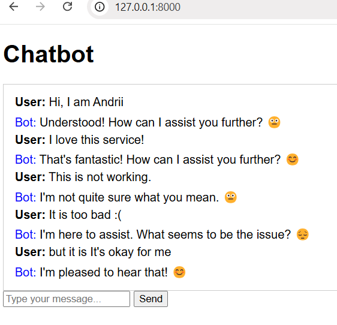

# Sentiment Analysis Bot
 This is a script of a chatbot that interacts with users and performs basic sentiment analysis on the input. The chatbot classify user messages as positive, negative, or neutral and respond accordingly.

## How Setup and Execution code

1. **Clone the repository**:
    ```sh
    git clone https://github.com/Andrii-Bezkrovnyi/sentiment_analysis_bot.git
    ```

2. **Create a virtual environment**:
    ```sh
    python -m venv venv
    venv\Scripts\activate (on Windows) 
    python3 -m venv venv
    source venv/bin/activate  (on Linux)
    ```

3. **Install the required packages**:
    ```sh
    pip install -r requirements.txt
    ```

4. **Create the database tables based on the models defined:**:
    
   ```sh
    python manage.py migrate
    ```   
5. **Start the Django development server:** 
    ```shell
    python manage.py runserver
    ```
6. **Open chatbot page by navigating to http://127.0.0.1:8000/ in your web browser**

7. **Enter your message for bot in the "Type your message..." field and click the "Send" button.**

8. **View bot answer on the page**
## Example of bot work
